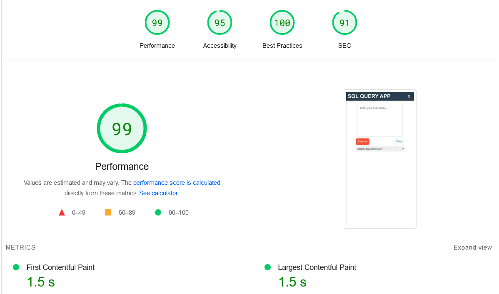
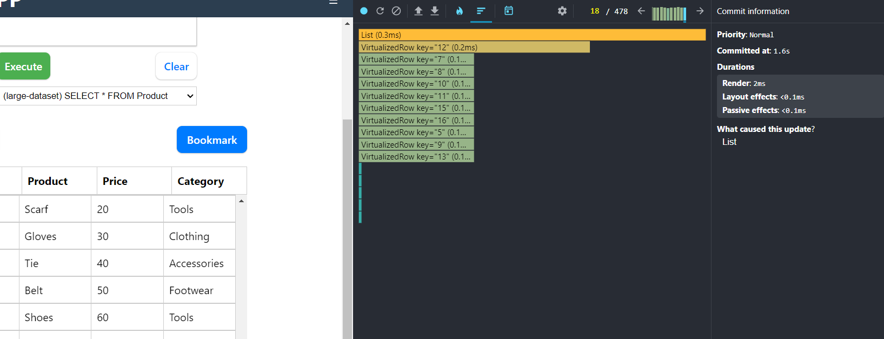

# SQL Query App

Live: [SQL Query App](https://transcendent-malabi-550033.netlify.app/)

## Description

SQL Query App is a user-friendly web-based application that enables users to input SQL queries and view the query results displayed in a convenient table format. Along with its core functionality, the application offers additional features such as query bookmarking, query exporting, and maintaining a query history. To enhance performance when dealing with large data sets, the application utilizes virtualization. The project aims to provide an efficient and intuitive tool for running SQL queries and managing query-related tasks.

## Features

-   **SQL Query Execution**: Users can input SQL queries in the application, and the system will execute them, displaying the corresponding results in a table format.

-   **Custom Field Validations**: The application performs custom field validations to ensure that users input valid data and format their queries correctly.

-   **Virtualization**: To improve performance when dealing with large data sets, the application employs virtualization techniques, ensuring smooth rendering and handling of extensive query results.

-   **Query Bookmarking**: Users can bookmark frequently used or important queries, allowing them to access and execute them quickly without typing the entire query again.

-   **Query History**: The application maintains a history of executed queries, enabling users to review and re-run previous queries easily.

-   **Query Export**: Users have the option to export query results in various formats, such as CSV or Excel, for further analysis or sharing with others.

-   **User-Friendly Interface**: The application offers a clean and intuitive user interface, making it easy for users to navigate and interact with the tool.

-   **Responsiveness**: The application is designed to be responsive, adapting to various screen sizes and devices for a seamless user experience.

-   **Lightweight Frontend**: The frontend of the application is optimized for efficiency, ensuring quick loading times and a smooth user interaction.

### Technologies Used

-   "Vite"
-   "React"
-   "GitHub"
-   "Netlify"
-   "Local Storage"
-   "Virtualization"
-   "JavaScript (ES6+)"
-   "CSS"

### Project Dependencies

The following external libraries and packages are used in this project:

-   **React**: A JavaScript library for building user interfaces.
-   **react-csv**: A library for exporting data to CSV format in React applications.
-   **react-dom**: Provides DOM-specific methods for React components.
-   **react-router-dom**: A collection of navigation components for React applications.
-   **react-virtualized-auto-sizer**: A wrapper component that automatically resizes its child to fit the available width and height.
-   **react-window**: A library for efficiently rendering large lists and tabular data in React applications.
-   **uuid**: A library for generating and working with universally unique identifiers (UUIDs).

## Page Load Time

I used Google PageSpeed Insights to measure the performance of my application. The tool provided the following key performance metrics:

-   **First Contentful Paint (FCP)**: 1.5 seconds
-   **Largest Contentful Paint (LCP)**: 1.5 seconds
-   **Total Blocking Time (TBT)**: 30 milliseconds
-   **Cumulative Layout Shift (CLS)**: 0
-   **Speed Index**: 3.1 seconds

### PageSpeed Insights Metrics:

## Performance Optimization

-   Utilized `react-window` for `virtualization` to efficiently handle large datasets, ensuring smooth scrolling and rendering of the table.
-   Employed `React Profiler` to measure rendering performance, achieving an `impressive 2ms rendering time for the entire table`, with `each virtual row rendering in just 0.1-0.2ms`. This guarantees a highly performance, even with extensive data.

### React Profiler Metrics:

